# Module 2: Deploy Linux and PostgreSQL infrastructure​

This unit guides you through the creation of the compute resources that host your application within Azure.

There are multiple methods to deploy infrastructure in Azure, including the Azure portal, the Azure CLI, and infrastructure-as-code templates (including Bicep and Terraform). In this unit, you deploy a preconfigured Bicep template that encapsulates the compute resources required for your application. The key resources are:

- A virtual machine running Linux (Ubuntu 24.04 LTS)
- Azure Database for Postgres running [Postgres 16 or later][2]
- A [managed identity][docs-url-3] to enable secure access from the VM to the database
- [RBAC][docs-url-4], including roles to access the database as an administrator, and more restrictive roles for the application itself
- A virtual network for both the VM and the database

Because this example is a dev/test workload, and we want to keep things both cost-effective and performant, we chose the following configuration for you:

- The VM is a Standard D2s_v4 (two vCPUs, 8 GB of memory). It has Azure Premium SSD with 3,200 maximum I/O operations per second (IOPS) and 128 GB of storage. It has an attached P10 128-GB Premium SSD disk with 500 IOPS for the OS disk. You can upgrade the OS disk to match the VM's IOPS as required.

- The database is a General Purpose D2ds_v4 (two vCores, 8 GB of RAM) with 3,200 maximum IOPS. It has a P10 128-GB Premium SSD disk with 500 IOPS. You can upgrade this disk to match the compute IOPS as required.

At the completion of the module, you delete these resources to save costs. However, you can also turn off the VM and database when they're not in use to save compute costs and pay for only the storage that you use. You can also scale up this workload as needed.

The Bicep template in this module utilizes [Azure Verified Modules (AVM)][5]. AVM is an initiative to standardize infrastructure-as-code modules. Microsoft maintains these modules, and they encapsulate many best practices for deploying resources in Azure.

## Ensure that you have an Azure subscription and the Azure CLI

If you don't have an Azure subscription, create a [free account][6] before you begin.

This module requires Azure CLI version 2.0.30 or later. Find the version by using the following command:

```bash
az --version
```

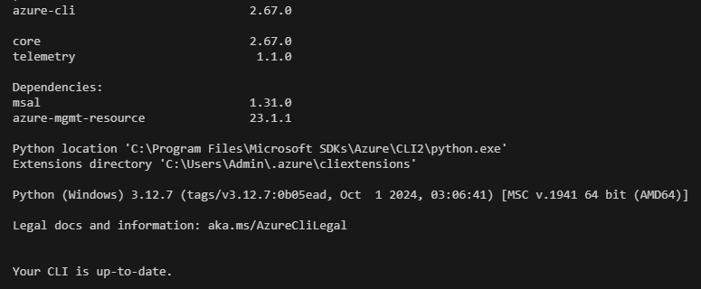

If you need to install or upgrade, see [How to install the Azure CLI][docs-url-7].

## Sign in to Azure by using the Azure CLI

1. To run commands in Azure by using the Azure CLI, you need to sign in first. Sign in by using the `az login` command:

    ```bash
    az login
    ```

1. If prompted, enter the number for your Subscription and Tenant.

## Create a resource group

A resource group is a container for related resources. All resources must be placed in a resource group. Use the [az group create][docs-url-8] command to create a resource group:

```bash
az group create \
    --name 240900-linux-postgres \
    --location westus2
```

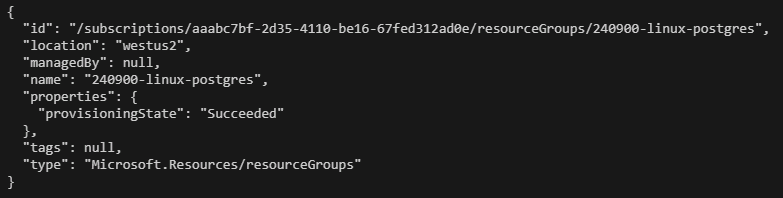

## Deploy the Bicep template by using the Azure CLI

Bicep is a domain-specific language (DSL) that uses declarative syntax to deploy Azure resources. In a Bicep file, you define the infrastructure that you want to deploy to Azure. You then use that file throughout the development life cycle to repeatedly deploy your infrastructure. Your resources are deployed in a consistent manner.

The Bicep file that you're using to deploy the compute resources for this unit is in the [deploy/vm-postgres.bicep][9] GitHub repo. It contains a virtual machine, a virtual network, a managed identity, and a network security group (NSG) for the VM. 

You can read more about Bicep in [What is Bicep?][docs-url-1].

1. Clone the example repo to your local machine:

    ```bash
    git clone https://github.com/Azure-Samples/linux-postgres-migration.git
    ```

    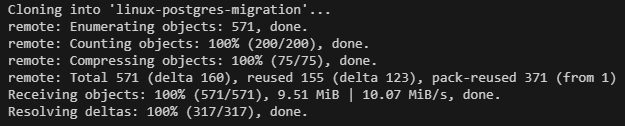

1. Go to the **linux-postgres-migration** directory:

    ```bash
    cd linux-postgres-migration
    ```

1. Deploy the Bicep template:

    ```bash
    az deployment group create \
        --resource-group 240900-linux-postgres \
        --template-file deploy/vm-postgres.bicep
    ```

    **Alert:** The deployment may take around 10 minutes to complete.

    At the completion of the deployment, JSON output confirms that the resources are deployed.

    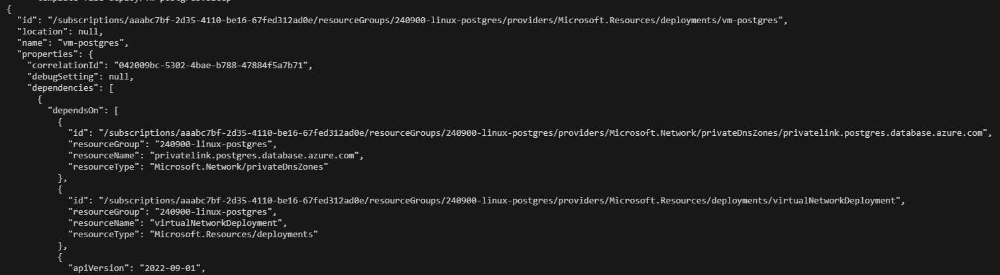

In the next sections, you'll configure and explore RBAC roles and network security rules on your deployed infrastructure by using the Azure portal. When you use the Azure portal, you can encode the roles and rules into the Bicep template. The Azure portal provides a visual interface that makes it easier to understand the relationships between resources and the permissions that are assigned to them.

## Open the resource group in the Azure portal

1. Open the [Azure portal][10].

1. On the service menu, select **Resource groups**.

    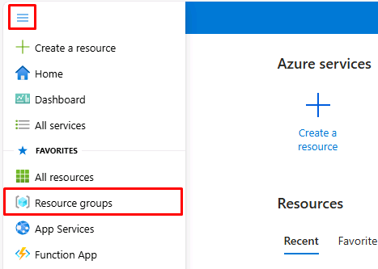

1. On the **Resource groups** pane, select the resource group **240900-linux-postgres**.

    In the upper-right part of the pane, the **Deployments** area shows the status of your Bicep template deployment. When deployment is successful, it shows **Succeeded**.

    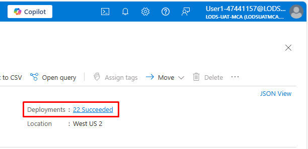

## View the virtual machine's network security group

1. Select the virtual machine, **vm-1**.

1. On the service menu, under the **Networking** section, select **Network settings**.

    The network settings show that the network security group (**240900-linux-postgres-nsg**) is attached to the same subnet of the virtual network (**240900-linux-postgres-vnet**) as the virtual machine.

The NSG is also visible inside the resource group. It contains a set of inbound and outbound security rules that control the traffic to and from the virtual machine.

## Return to the resource group

At the top-left of the page, select the **240900-linux-postgres** breadcrumb link to return to your resource group.

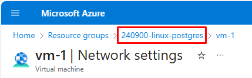

Note that the **240900-linux-postgres-identity** user-assigned managed identity is listed in the resource group.

You can learn more about system-assigned and user-assigned managed identities in [What are managed identities for Azure resources?][docs-url-11].

## Add an inbound security rule to the network security group

Add an inbound security rule to the NSG to allow SSH traffic from your current IP address to the virtual machine.

In a production scenario, you would often use [just-in-time access][docs-url-12], [Azure Bastion][docs-url-13], or a VPN (such as Azure or a mesh VPN) to restrict access to your virtual machine.

1. Select **240900-linux-postgres-nsg**.

1. On the service menu, select **Settings**, then select **Inbound security rules**.

1. Select **Add**.

    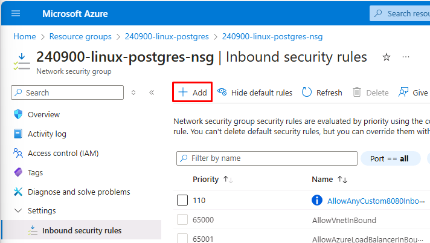

1. Under **Source**, select **My IP address**.

1. Under **Service**, select **SSH**.

1. Select **Add**.

    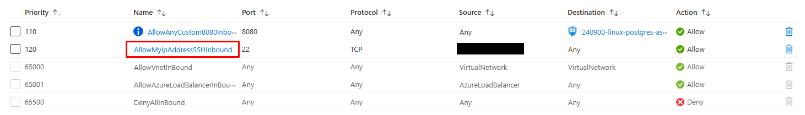

## View the administrator for the Azure Database for PostgreSQL flexible server

1. Select the **240900-linux-postgres** breadcrumb link to return to your resource group.

1. Find and select the Azure Database for PostgreSQL flexible server named **postgres-xxxxx**, where **xxxxx** is a unique string that the Bicep template defined. The string remains consistent across deployments to your subscription and resource group.

1. On the service menu, select **Security**, then select **Authentication**.

For this scenario, you're using **Microsoft Entra authentication only**. The **240900-linux-postgres-identity** user-assigned managed identity is listed under **Microsoft Entra Admins**.

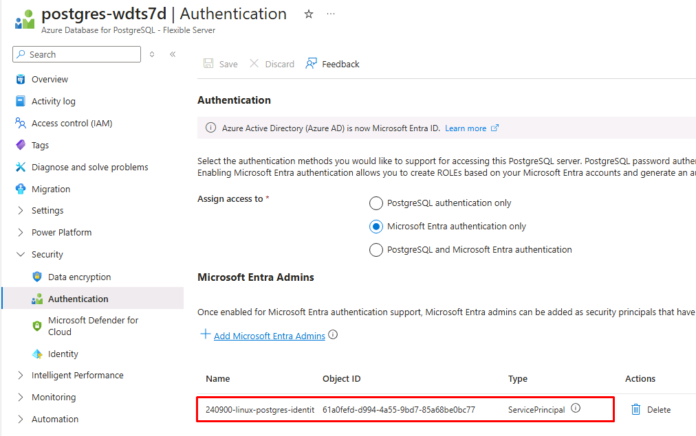

The **240900-linux-postgres-identity** managed identity is currently the only administrator for the server. You can optionally add your own user account as an administrator. But for this scenario, you'll use the managed identity that's already in place.

In an upcoming section, you use the identity from the virtual machine to administer the server via the Azure CLI. You also use that identity to provide access to the server for your application.

In a production scenario, you would likely use a combination of managed identities, Microsoft Entra ID, and fine-grained RBAC to enable your application workload to access data and manage resources in Azure securely. You would follow the principle of least privilege.

Read more about these scenarios:
- [Microsoft Entra authentication with Azure Database for PostgreSQL - Flexible Server][docs-url-14]
- [Use Microsoft Entra ID for authentication with Azure Database for PostgreSQL - Flexible Server][docs-url-15].

## Review the Azure Database for PostgreSQL Flexible Server firewall rules

On the service menu, select **Settings**, then select **Networking**.

If you were administering the server from your local machine, rather than the virtual machine, you would need to add your IP address to the firewall rules.

You could create a firewall rule for your current IP address by selecting **Add current client IP address (xxx.xxx.xxx.xxx)** > **Save**. This rule would let you access the dev/test server by using tools on your local machine. But because you're using a virtual machine to access the database, you won't create a firewall rule at this time.

In production, you would likely isolate this server from the public internet entirely by clearing the **Allow public access to this resource through the internet using a public IP address** option.

Unlike the virtual machine, you haven't associated Azure Database for PostgreSQL with any virtual network. You retain the option of accessing Azure Database for PostgreSQL over the public internet, which is useful for dev/test scenarios.

To provide both security and flexibility, you enable access from the virtual machine via its virtual network by using a private endpoint. The private endpoint allows the virtual machine to access the database without exposing it to the public internet. 

Read more about private endpoints:
- [Azure Database for PostgreSQL - Flexible Server networking with Private Link][docs-url-16].

Here, the private endpoint has been created for you using Bicep.

## Review the role assignments for the virtual machine's system-assigned managed identity

1. Select the **240900-linux-postgres** breadcrumb link to return to your resource group.

1. Select **vm-1**.

1. On the service menu, select **Security**, then select **Identity**.

    Here, you can confirm that the system-assigned managed identity is attached to the virtual machine.

1. On the **System assigned** tab, under **Permissions**, select **Azure role assignments**.

    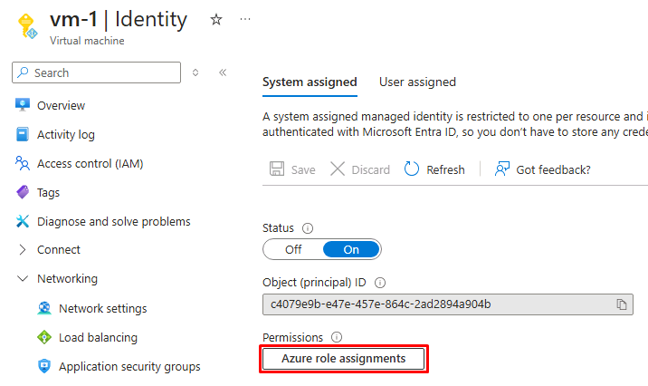

1. Confirm that the **Reader** role is assigned to the system-assigned managed identity. The role is scoped to the **240900-linux-postgres** resource group.

The permissions in this identity allow you to use the Azure CLI within the VM to list resources in the resource group. With this ability, you don't have to hard-code specific resource details into your scripts.

At a later stage, you'll assign an additional role to the VM's managed identity so that the VM can directly access an Azure Blob Storage account.

Next, you'll explore and configure the deployed infrastructure.

## Resources

- [Azure Verified Modules][5]
- [Install the Azure CLI][docs-url-7]
- [Create a resource group by using the Azure CLI][docs-url-8]
- [Azure RBAC][docs-url-4]
- [Azure managed identity][docs-url-3]
- [What is Bicep?][docs-url-1]
- [What are managed identities for Azure resources?][docs-url-11]
- [Enable just-in-time access on VMs][docs-url-12]
- [What is Azure Bastion?][docs-url-13]
- [Microsoft Entra authentication with Azure Database for PostgreSQL - Flexible Server][docs-url-14]
- [Use Microsoft Entra ID for authentication with Azure Database for PostgreSQL - Flexible Server][docs-url-15]
- [Azure Database for PostgreSQL - Flexible Server networking with Private Link][docs-url-16]

[docs-alt-1]: /azure/azure-resource-manager/bicep/overview?tabs=bicep
[docs-url-1]: https://learn.microsoft.com/azure/azure-resource-manager/bicep/overview?tabs=bicep
[2]: https://www.postgresql.org/download/
[docs-alt-3]: /entra/identity/managed-identities-azure-resources/overview
[docs-url-3]: https://learn.microsoft.com/entra/identity/managed-identities-azure-resources/overview
[docs-alt-4]: /azure/role-based-access-control/overview
[docs-url-4]: https://learn.microsoft.com/azure/role-based-access-control/overview
[5]: https://azure.github.io/Azure-Verified-Modules/
[6]: https://azure.microsoft.com/free/
[docs-alt-7]: /cli/azure/install-azure-cli
[docs-url-7]: https://learn.microsoft.com/cli/azure/install-azure-cli
[docs-alt-8]: /cli/azure/group
[docs-url-8]: https://learn.microsoft.com/en-us/cli/azure/group?view=azure-cli-latest#az-group-create
[9]: https://github.com/Azure-Samples/linux-postgres-migration/blob/main/deploy/vm-postgres.bicep
[10]: https://portal.azure.com
[docs-alt-11]: /entra/identity/managed-identities-azure-resources/overview#managed-identity-types
[docs-url-11]: https://learn.microsoft.com/entra/identity/managed-identities-azure-resources/overview#managed-identity-types
[docs-alt-12]: /azure/defender-for-cloud/just-in-time-access-usage
[docs-url-12]: https://learn.microsoft.com/azure/defender-for-cloud/just-in-time-access-usage
[docs-alt-13]: /azure/bastion/bastion-overview
[docs-url-13]: https://learn.microsoft.com/azure/bastion/bastion-overview
[docs-alt-14]: /azure/postgresql/flexible-server/concepts-azure-ad-authentication
[docs-url-14]: https://learn.microsoft.com/azure/postgresql/flexible-server/concepts-azure-ad-authentication
[docs-alt-15]: /azure/postgresql/flexible-server/how-to-configure-sign-in-azure-ad-authentication
[docs-url-15]: https://learn.microsoft.com/azure/postgresql/flexible-server/how-to-configure-sign-in-azure-ad-authentication
[docs-alt-16]: /azure/postgresql/flexible-server/concepts-networking-private-link
[docs-url-16]: https://learn.microsoft.com/azure/postgresql/flexible-server/concepts-networking-private-link
