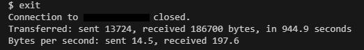

# Module 3: Configure a Linux application workload​

In this unit, you will:

- Configure a Linux application workload to connect to Azure Database for PostgreSQL by using a system-assigned managed identity.
- Connect to the [Azure virtual machine by using the Azure CLI][docs-url-1].
- Install the necessary tools.
- Connect to the PostgreSQL server by using **psql**.
- Clone the repository that contains the sample application.
- Run the application and confirm that it can connect to the PostgreSQL server by using the managed identity.

## Connect to the Azure virtual machine by using the Azure CLI

1. Get the currently signed in user and the VM ID:

    ```bash
    USER_ID=$(az ad signed-in-user show --query id --output tsv)
    VM_ID=$(az vm show --resource-group 240900-linux-postgres --name vm-1 --query id --output tsv)
    ```

    >**Alert:** This may take a couple minutes to complete.

1. Assign the **Virtual Machine Administrator Login** role to the user for the VM:

    ```bash
    az role assignment create \
        --assignee $USER_ID \
        --scope $VM_ID \
        --role "Virtual Machine Administrator Login"
    ```

    

    You can read more about privileged roles for Azure VMs in [Azure built-in roles for Privileged][docs-url-2].

1. Connect to the virtual machine:

    ```bash
    az ssh vm --resource-group 240900-linux-postgres --name vm-1
    ```

1. If prompted to install the ssh extension, enter `Y`.

1. Enter `yes` on the prompt to continue connecting.

## Install psql, Go and Azure CLI on the virtual machine

1. Update the package list:

    ```bash
    sudo apt-get update
    ```

1. Install the PostgreSQL client and Go (Golang) on the virtual machine:

    ```bash
    sudo apt-get install -y postgresql-client golang-go
    ```

1. Confirm the version of psql:

    ```bash
    psql --version
    ```

1. Install the Azure CLI on the virtual machine

    ```bash
    curl -sL https://aka.ms/InstallAzureCLIDeb | sudo bash
    ```

## Connect to the PostgreSQL server by using Bash and psql

1. Sign in to the Azure CLI by using the system-assigned managed identity:

    ```bash
    az login --identity
    ```

    The output will be similar to the following:

    

1. Connect to the PostgreSQL server:

    ```bash
    MANAGED_IDENTITY_NAME=240900-linux-postgres-identity
    export AZURE_CLIENT_ID=$(az identity show --resource-group 240900-linux-postgres --name $MANAGED_IDENTITY_NAME --query "clientId" -o tsv)
    PG_NAME=$(az postgres flexible-server list --resource-group 240900-linux-postgres --query "[0].name" -o tsv)

    # Set psql environment variables
    export PGHOST="${PG_NAME}.privatelink.postgres.database.azure.com"
    export PGPASSWORD=$(curl -s "http://169.254.169.254/metadata/identity/oauth2/token?api-version=2018-02-01&resource=https%3A%2F%2Fossrdbms-aad.database.windows.net&client_id=${AZURE_CLIENT_ID}" -H Metadata:true | jq -r .access_token)
    export PGUSER=$MANAGED_IDENTITY_NAME
    export PGDATABASE=postgres

    # Sign in by using psql
    psql
    ```

    After you're connected, output similar to the following appears:

    

1. Enter `\q` to exit.

## Clone the sample application

1. Clone the sample application, Tailwind Traders (Go) by running the following commands on the remote machine:

    ```bash
    git clone https://github.com/Azure-Samples/tailwind-traders-go.git
    ```

1. Change to the application directory:

    ```bash
    cd tailwind-traders-go/app/
    ```

1. Run the application:

    ```bash
    go run main.go
    ```

    The output will be similar to the following:

    

## PostgreSQL server connection using the Tailwind Traders (Go) app:token target

1. Sign in using Go and psql:

    ```bash
    MANAGED_IDENTITY_NAME=240900-linux-postgres-identity
    export AZURE_CLIENT_ID=$(az identity show --resource-group 240900-linux-postgres --name $MANAGED_IDENTITY_NAME --query "clientId" -o tsv)
    PG_NAME=$(az postgres flexible-server list --resource-group 240900-linux-postgres --query "[0].name" -o tsv)

    # psql
    export PGHOST="${PG_NAME}.privatelink.postgres.database.azure.com"
    export PGPASSWORD=$(go run main.go app:token)
    export PGUSER=$MANAGED_IDENTITY_NAME
    export PGDATABASE=postgres

    # Sign in by using psql
    psql
    ```

1. Quit **psql**:

    ```bash
    \q
    ```

1. Disconnect from the remote machine:

    ```bash
    exit
    ```

    

## Resources

- [Sign in to a Linux virtual machine in Azure by using Microsoft Entra ID and OpenSSH][docs-url-3]
- [Connect to an Azure Database for PostgreSQL server by using a managed identity][docs-url-4]
- [Create a Linux virtual machine with the Azure CLI on Azure][docs-url-1]
- [Azure built-in roles for Privileged][docs-url-2]

[docs-alt-1]: /azure/virtual-machines/linux/quick-create-cli
[docs-url-1]: https://learn.microsoft.com/azure/virtual-machines/linux/quick-create-cli
[docs-alt-2]: /azure/role-based-access-control/built-in-roles/privileged#role-based-access-control-administrator
[docs-url-2]: https://learn.microsoft.com/azure/role-based-access-control/built-in-roles/privileged#role-based-access-control-administrator
[docs-alt-3]: /entra/identity/devices/howto-vm-sign-in-azure-ad-linux
[docs-url-3]: https://learn.microsoft.com/entra/identity/devices/howto-vm-sign-in-azure-ad-linux
[docs-alt-4]: /azure/postgresql/single-server/how-to-connect-with-managed-identity
[docs-url-4]: https://learn.microsoft.com/azure/postgresql/single-server/how-to-connect-with-managed-identity
