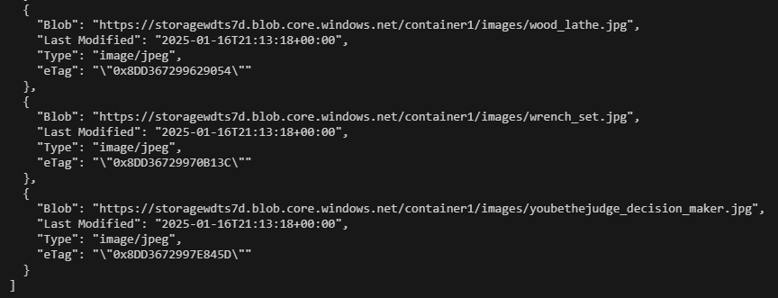

# Module 4: Explore and run Linux and PostgreSQL workloads​

In this unit, you'll:

- Deploy an Azure Blob Storage account by using a Bicep template.
- Create a Blob Storage container.
- Migrate images to the Blob Storage account.
- Upload **tailwind.sql** to the Blob Storage account.
- Connect to the Azure virtual machine by using the Azure CLI.
- Download the file from the storage account.
- Connect to the PostgreSQL server by using **psql** and import a SQL file.
- Run the application interactively via the command line.
- Confirm that the application runs correctly.


## Deploy and setup the Azure Blob Storage account

1. Deploy a storage account by using **deploy/vm-postgres.bicep**:

    ```bash
    az deployment group create \
        --resource-group 240900-linux-postgres \
        --template-file deploy/vm-postgres.bicep \
        --parameters \
            deployVm=false \
            deployPostgres=false \
            deployStorage=true
    ```

    >**Alert:** The deployment may take a few minutes to complete.

1. Add the current user to the **Storage Blob Data Owner** role:

    ```bash
    STORAGE_ACCOUNT_ID=$(az storage account list \
        --resource-group 240900-linux-postgres \
        --query '[0].id' \
        -o tsv)

    USER_ID=$(az ad signed-in-user show \
        --query id \
        -o tsv)

    az role assignment create \
        --role "Storage Blob Data Owner" \
        --assignee $USER_ID \
        --scope $STORAGE_ACCOUNT_ID
    ```

1. Create a container called **container1** in the storage account:

    ```bash
    STORAGE_ACCOUNT_NAME=$(az storage account list \
        --resource-group 240900-linux-postgres \
        --query '[0].name' \
        -o tsv)

    echo "STORAGE_ACCOUNT_NAME: $STORAGE_ACCOUNT_NAME"

    az storage container create \
        --account-name $STORAGE_ACCOUNT_NAME \
        --auth-mode login \
        --name container1
    ```

1. Migrate images to the storage account into a subfolder:

    ```bash
    az storage blob upload-batch \
        --account-name $STORAGE_ACCOUNT_NAME \
        --auth-mode login \
        --overwrite \
        --destination container1/images \
        --source app/data/images
    ```

    The output will be similar to the following:

    

1. Upload **app/data/postgres/tailwind.sql** to the storage account:

    ```bash
    az storage blob upload \
        --account-name $STORAGE_ACCOUNT_NAME \
        --auth-mode login \
        --container-name container1 \
        --file app/data/postgres/tailwind.sql \
        --name tailwind.sql
    ```

## Download and import a SQL file using psql

1. Connect to the Azure virtual machine by using the **az ssh** command:

    ```bash
    az ssh vm \
        --resource-group 240900-linux-postgres \
        --name vm-1
    ```

1. Download the **tailwind.sql** file from the storage account by setting the Bash variable **STORAGE_ACCOUNT_NAME** to the storage account name:

    ```bash
    STORAGE_ACCOUNT_NAME=$(az storage account list \
        --resource-group 240900-linux-postgres \
        --query '[0].name' \
        -o tsv)

    echo "STORAGE_ACCOUNT_NAME: $STORAGE_ACCOUNT_NAME"
    ```

1. Download **tailwind.sql** to the Azure virtual machine by using the **az storage blob download** command:

    ```bash
    az storage blob download \
        --account-name $STORAGE_ACCOUNT_NAME \
        --auth-mode login \
        --container-name container1 \
        --file tailwind.sql \
        --name tailwind.sql
    ```

1. Set the environment variables for **psql** on the remote machine:

    ```bash
    MANAGED_IDENTITY_NAME=240900-linux-postgres-identity
    export AZURE_CLIENT_ID=$(az identity show --resource-group 240900-linux-postgres --name $MANAGED_IDENTITY_NAME --query "clientId" -o tsv)
    PG_NAME=$(az postgres flexible-server list --resource-group 240900-linux-postgres --query "[0].name" -o tsv)

    # Set psql environment variables
    export PGHOST="${PG_NAME}.privatelink.postgres.database.azure.com"
    export PGPASSWORD=$(curl -s "http://169.254.169.254/metadata/identity/oauth2/token?api-version=2018-02-01&resource=https%3A%2F%2Fossrdbms-aad.database.windows.net&client_id=${AZURE_CLIENT_ID}" -H Metadata:true | jq -r .access_token)
    export PGUSER=$MANAGED_IDENTITY_NAME
    export PGDATABASE=postgres
    ```

1. Import **tailwind.sql** by using **psql**:

    ```bash
    psql -f tailwind.sql
    ```

## Connect to the Postgres server to confirm the import was successful

1. Connect to the Postgres server:

    ```bash
    psql
    ```

1. List the tables:

    ```bash
    \dt
    ```

    The following output appears:

    

1. Run a SQL query that lists the tables:

    ```
    SELECT table_name
    FROM information_schema.tables
    WHERE table_schema = 'public';
    ```

    The following output appears:

    

1. Turn on expanded mode at the **postgres=>** prompt:

    ```
    \x
    ```

1. In expanded mode, select from the products table:

    ```
    select * from products;
    ```

    A listing of products appears:

    

1. Use **Spacebar** to page through the results. Enter `q` to exit the pager.

1. Enter `\q` to exit **psql**.

## Run the application interactively via the command line

1. On the remote machine, change to the directory that contains the application:

    ```bash
    cd tailwind-traders-go/app
    ```

1. Run the application interactively from the command line:

    ```bash
    go run main.go app:serve
    ```

    The following output appears:

    

1. Open a second terminal window or tab to run commands alongside the running application.

1. In the new terminal, get the public IP address of the virtual machine:

    ```bash
    IP_ADDRESS=$(az network public-ip show \
        --resource-group 240900-linux-postgres \
        --name vm-1-ip \
        --query ipAddress \
        --out tsv)
    ```

1. Output the URL to the terminal:

    ```bash
    echo "Your URL is: http://${IP_ADDRESS}:8080"
    ```

    This unit uses port 8080 for interactive dev/test purposes. In production, you would use port 443 and require a TLS certificate to help secure traffic to the endpoint.
    
1. Open the URL in a web browser. 

    Output similar to the following appears:

    

1. Alternatively, you can make a request to the API endpoint by using **curl**:

    ```bash
    curl "http://${IP_ADDRESS}:8080"
    ```

    This endpoint displays a random product from the database.

1. Return to the terminal where you're running the application interactively.

1. Note the output shows the requests to the API endpoint:

    

    If these requests were successful, you've successfully migrated the application workload to an Azure virtual machine and Azure Database for PostgreSQL (Flexible Server).

## Clean up Azure resources

After you finish exploring the Linux and PostgreSQL workloads, clean up the resources to save costs. You can delete the resource group **240900-linux-postgres** manually via the Azure portal. 

More efficiently, in your second terminal, run the following Azure CLI command:

```bash
az group delete \
    --name 240900-linux-postgres \
    --yes \
    --no-wait
```

Alternatively, you can use the **empty.bicep** template to delete the resources that the **vm-postgres.bicep** file created. Running **az deployment group create** with **--mode Complete** removes any resources that the template doesn't define. Because **empty.json** has no resources, the command deletes every resource:

```bash
az deployment group create \
    --resource-group 240900-linux-postgres \
    --template-file deploy/empty.bicep \
    --mode Complete
```

>**Note:** Deploying **empty.json** leaves the **240900-linux-postgres** resource group intact, so you can deploy the resources again by using a single command.

## Resources

- [Azure Blob Storage documentation][docs-url-1]
- [Azure RBAC documentation][docs-url-2]

[docs-alt-1]: /azure/storage/blobs/
[docs-url-1]: https://learn.microsoft.com/azure/storage/blobs/
[docs-alt-2]: /azure/role-based-access-control/overview
[docs-url-2]: https://learn.microsoft.com/azure/role-based-access-control/overview
